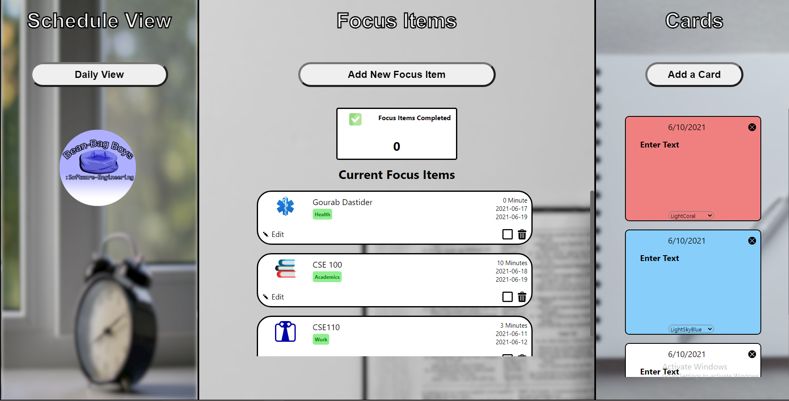

# Team 27: Bean-Bag Boys

https://bean-bag-boys-bujo.herokuapp.com/

[Team Page](./admin/team.md)

## The Bullet Journal

The Bullet Journal is a CRUD application that will encourage its users to adopt the AGILE principles with which it has been developed. 
The Bullet Journal is a personalized aid to keep track of commitments, classes, events, and remember important information.

## CI/CD Pipline Information
- You can find out more about how the [continuous integration](./admin/cipipeline) works within our codebase! 

## User-End Documentation
- Here is a link to learn how to [use](./docs/Users%20Story%20Document.pdf) our Bullet Journal App!

## Developer Onboarding Documentation
- Want to become a contributor? Figure out how our [Codebase](./admin/onboard.md) runs!

## Design
- Here is a link to [Architectural Documentation Records](./specs/adrs)
- Take a look at our [high fidelity wireframes]() and [prototypes]()

## Sprints
- Sprint #1
  - [Sprint Review](./admin/meetings/051621-sprint-1-review.md)
  - [Retrospective](./admin/meetings/051621-retrospective.md)
- Sprint #2
  - [Sprint Review](./admin/meetings/053121-sprint-2-review.md)
  - [Retrospective](./admin/meetings/053121-retrospective2.md)

## Administration
- Here are the [meeting notes.](./admin/meetings)
- Here are the [Daily Standups.](./admin/dailyStandups)
- Here is the [team contract.](./admin/misc)
- Here are all the [videos](./admin/videos) for this quarter.

## Source
- Here is a link to the source [code](./source) of the Bullet Journal!

## Testing
- Here is a look at our testing suite!

