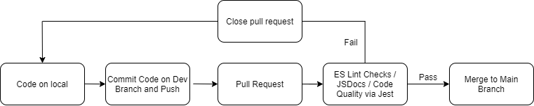

# Phase I status of the Pipeline 



## What is currently functional?


First, we are utilizing ES lint. This will execute upon a developer's pull request. It will determine whether or not the user has maintained quality code along with proper styling. Furthermore, we have conducted some testing using different branches. Our GitHub actions have shown promising results as it is currently indicating it is functional. We chose ES lint as we felt it has a lot of relevance to our project. It was also recommended over other linting programs. Moving forward, we still feel that there is more testing required to fully understand ES Lint and its intricacies. At the moment we are pleased with the results with linting.

``````

name: Linting

on:
  pull_request:
    branches:
      - main
  
jobs:
  eslint:
    name: Install and run ESLint
    runs-on: ubuntu-latest
    
    steps:
      - name: Checkout code
        uses: actions/checkout@v2
      
      - name: Install ESLint
        working-directory: ./source
        run: npm install eslint --save-dev
          
      - name: Set up config
        working-directory: ./source
        run: npx eslint --init
         
      - name: Run ESLint
        working-directory: ./source
``````

Second, JSDocs will be utilized for document generation. It stood out to us due to its simplicity and recommendations. At the moment it seems to be functional given that the GitHub Actions is verifying pull requests. It seems to be functional. However, it is still early in the stage and we require more testing. It is important to note that `index.js` is a temporary file needed to pass these tests. Moving forward, there may be slight changes to the workflow as upcoming project decisions will cause so. We are pleased with this workflow's function and feel comfortable using it as part of our pipeline. 

``````
name: Document Generator

on:
  pull_request:
    branches:
      - main
jobs:
  deploy:
    runs-on: ubuntu-latest
    steps:
      - name: Checkout code
        uses: actions/checkout@v2
        with:
          ref: ${{ github.event.pull_request.head.ref }}
          
      - name: Set up Node.js
        uses: actions/setup-node@v1
        with:
          node-version: 12
          
      - name: Install JSDocs
        working-directory: ./source
        run: npm install -g jsdoc
        
      - name: run JSDoc
        working-directory: ./source
        run: jsdoc index.js -d ../docs
        
      # Adopted some of the commit file template from https://github.com/marketplace/actions/generate-documentation
      - name: Commit files
        run: |
          git add .
          git config --local user.email "41898282+github-actions[bot]@users.noreply.github.com"
          git config --local user.name "github-actions[bot]"
          git commit -m "CI: Automated build push" -a
          git push
``````

## What is currently in progress?

Third, our testing workflow is still currently in progress. We have made the decision to use Jest as the tester. At the moment, the GitHub Actions page shows the tests failing each time upon a tested pull request. While we have added proper code to the workflow, we have not made the sufficient tests to illustrate that it is functional. We do expect it to work once we tested it using JavaScript files. We feel that Jest is best suited for the project given its simplicity and ease of understanding. Moving forward, we will continue testing this workflow to complete the minimum of three workflows. 

``````
name: test

on:
 pull_request:
   branches:
     - main
jobs:
 deploy:
   runs-on: ubuntu-latest
   steps:     
     - name: Checkout code
       uses: actions/checkout@v2
     - name: Install jest
       working-directory: ./source
       run: npm install --save-dev jest
     - name: Run jest
       working-directory: ./source
       run: npm test
``````

## What is currently planned?

While we currently are working three workflows, we plan to incorporate two more. These two will most likely include end-to-end and an additional code quality workflow such as codacy. We will consider alternate workflows as we are seeking free alternatives. Furthermore, we plan on iterating the current implemented workflows to make sure we get the best out of it. Of course, we will consider the options that are easy to access and understand. This is a major priority given the short time period to complete the project with limited experience. Lastly, our pipeline diagram will be updated to reflect the nature and dynamic of the team as we have yet to truly begin the project with CSS, HTML, and Javascript files. In summary, iterate through the pipeline, add two additional workflows, update the diagram, and make additional tests to the workflow to illustrate GitHub actions passing these checks. 

