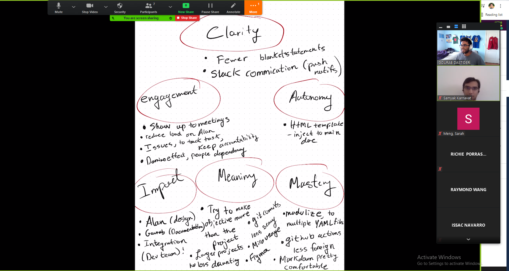

# Sprint #1 Retrospective
### Duration May 6th - Math 16th
## 1) Group 27: Bean Bag Boys

### *Date, time & location & writer:*
**Date:** `2021-05-16`

**Start Time:** `11:40 PM`

**End Time:** `12:07 PM`

**Platform:** `Zoom`

**Author:** `Gourab Dastider`

### Team members Present:
Gourab Dastider
Samyak Karnavat
Alan Tram (Out with Severe illness, Recapped asynchronously with Team Leads)
Sarah Meng
Raymond Wang
Xun Zhu
Issac Navarro
Richie Porras

### The Summary of the Sprint Review
- We began a simple debrief on what we felt went right and wrong with our progress as a team so far. Many of us shared the sentiment that at time we felt a bit lost in terms of what progress we should be making at certain points in the quarter. Gourab and Samyak then suggested to join a document and put down our sentiments with our progress specifically for this sprint.

### Sentiments
Goods:
- Communication 
- meeting attendance, 
- willingness work with TA

Bads:
- Work isolation for Alan
- Should have got TA feedback earlier

What can be improved:
- Splitting tasks into components or modules for easy collaboration
- Meeting with Professor in office hours for guidance

How we move on from here:
- Divide and Conquer
- Assign tasks based on individual strengths

### Mind Map
- After a quick discussion of our sentiments and ways to address our challenges. We decided to do an activity in terms of a MindMap for 6 key words: Clarity, Engagement, Impact, Meaning, Mastery, Autonomy
- We went one by one with adding a bullet point under any of these focus words
- This activity was able to shine light on the challenges that many of our teammates had that were previously less known. This gave us a chance to build more psychological safety as we could all admit to things that we were not comfortable handling. 
- Moreover, this exercise gave us an insight on things that must certainly do for the forthcoming sprint, for example using issues to keep accountability and decrease reliance on quick meetings and save us precious time. 