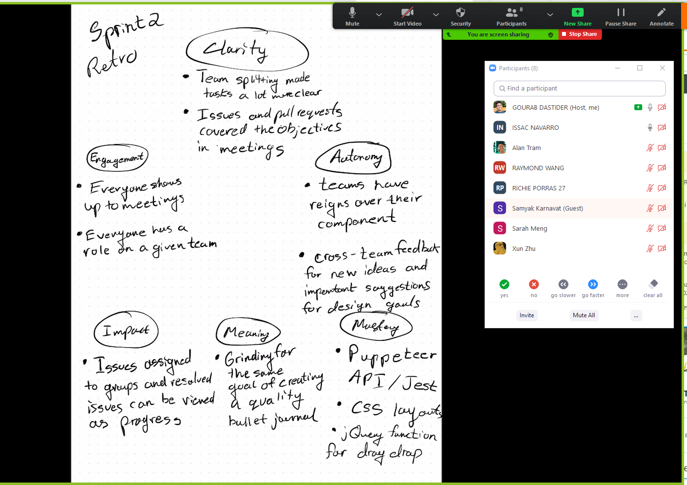

# Sprint #1 Retrospective
### Duration May 16th - May 31st
## 1) Group 27: Bean Bag Boys

### *Date, time & location & writer:*
**Date:** `2021-05-31`

**Start Time:** `3:11 PM`

**End Time:** `3:41 PM`

**Platform:** `Zoom`

**Author:** `Gourab Dastider`

### Team members Present:
Gourab Dastider
Samyak Karnavat
Alan Tram
Sarah Meng
Raymond Wang
Xun Zhu
Issac Navarro
Richie Porras

### The Summary of the Retrospecitive
- The first thing that we did with our retrospective was consider how much progress we made as a unit compared to last sprint. The big thing we noted was that we were much less lost compared to just 2 weeks ago. We are more in tune with what exactly we are looking to achieve and the plan to go about it. We give a big shoutout to our TA's plan for the finishing cycle of the project, it really helped us get back on track. Afterwards we decided to perform a similar exercise to last time with simply writing down the things that went well or bad, and how we can improve and move forward in a more productive manner. Finally we ended with a mind-map activity where group members shared experiences with regards to Clarity, Engagement, Impact, Meaning, Mastery, Autonomy.

### Sentiments
Goods:
- We worked very efficiently for development, caught up to groups which had a head start in terms of coding.
- Team splitting was successful, components were made and thoughtful architectural decisions were made.
- TA communication and planning was quite helpful to get us back on track
- Professor Office hours feedback was incorporated into high fidelity design

Bads:
- Rough part of the quarter, rough quarter in general
- Midterms, and assignments got in the way of development time

How we move on from here:
- Continue testing suite to be more exhaustive, End to end and unit tests.
- CSS to make site more visually appealing for the skeleton
- Begin thinking about documentation (user and developer)

### Mind Map
- After a quick discussion of our sentiments and ways to address our challenges, we decided to do an activity in terms of a MindMap for 6 key words: Clarity, Engagement, Impact, Meaning, Mastery, Autonomy
- This mindmap helped us reflect on our actions in an open setting and highlight things that we were able to do succesfully. We had a big commendation on the consistency of our group members attending meetings and staying on top of their tasks. 
- Moreover, our decision to a divide and conquer approach, greatly improved our productivity and allowed our group to catch up to other groups that started developing earlier on in the quarter.
- Finally the team was getting more comfortable with using github, issues, pull requests, and testing, which was a huge plus as we could see that we were gaining new skills and adopting the common software engineering principles. 